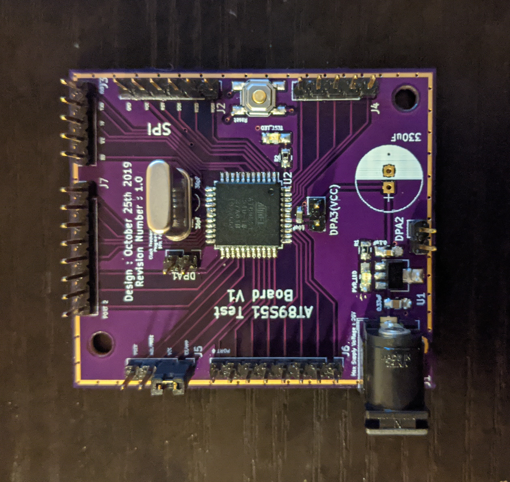

# AT89S51 8051 General Purpose Board

<h2> What is it? </h2>
This is a breakout for AT89S51 that I used during my research at UT Austin. The objective was to study the vulnerability of firmware running on the AT89S51 to Electromagnetic (EM) Side-Channel attacks. 

 

<h2> What we accomplished </h2>

1. We were successful in writing an instruction dissassembler that was able to dissassemble firmware with up to 98% accuracy using the EM side-channel
 
2. We were successful in writing a cycle level EM trace simulator that is capable of synthesizing EM trace corresponding to a firmware running on the AT89S51 with up to 90% accuracy

3. We used the cycle level EM trace simulator to successfully predict control flow leakge of the firmware and optimize it to show a decrease in control flow leakage  
<h2> What the repository contains ? </h2>

The AT89s51 directory contains the board design files. The PCB layouting was done in Kicad. The Bootloader directory contains a powershell script to simplify the usage of avr_dude.exe while burning the HEX file onto the board and the config file describes fuse settings, chip erase details and so on specific to the 8051 to avr_dude.

Please refer to https://1sand0s.github.io/make-your-own-8051at89s51-board.html for more details
